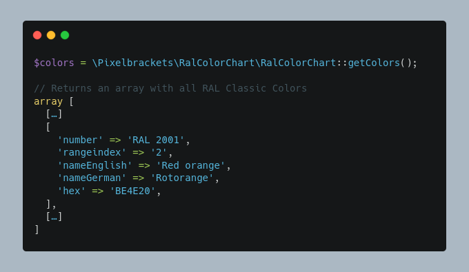

RAL Color Chart
===============

[](https://packagist.org/packages/pixelbrackets/ral-color-chart/)

This package provides a static table of [RAL Classic](https://www.ral-farben.de/) Colors.

The object may retun an array which contains the RAL Number, Range Index, 
English Name, German Name and a compatible Hex Color Code.



## Requirements

* PHP

## Installation

Packagist Entry https://packagist.org/packages/pixelbrackets/ral-color-chart/

## Source

https://gitlab.com/pixelbrackets/ral-color-chart/

## Usage

1. Get an array with all RAL Classic Colors
   ```php
   $colorChart = new \Pixelbrackets\RalColorChart\RalColorChart();
   $colors = $colorChart->getList();
   ```
1. Get an array with all RAL Classic Ranges
   ```php
   $colorChart = new \Pixelbrackets\RalColorChart\RalColorChart();
   $ranges = $colorChart->getRangeList();
   ```
1. Get an array with all RAL Classic Colors grouped by range index
   ```php
   $colorChart = new \Pixelbrackets\RalColorChart\RalColorChart();
   $groupedColors = $colorChart->getGroupedList();
   ```

## License

GNU General Public License version 2 or later

The GNU General Public License can be found at http://www.gnu.org/copyleft/gpl.html.

## Author

Dan Untenzu (<mail@pixelbrackets.de> / [@pixelbrackets](https://pixelbrackets.de))

## Changelog

See [./CHANGELOG.md](CHANGELOG.md)

## Contribution

This script is Open Source, so please use, patch, extend or fork it.
